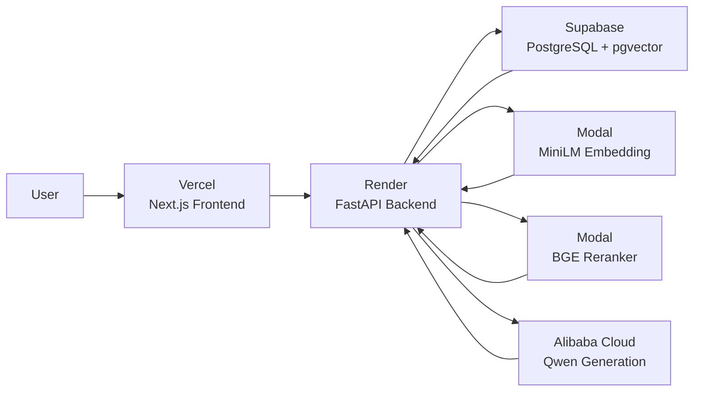
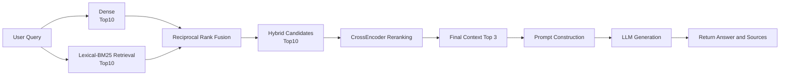

# Study Notes

A full-stack technical notes platform with an evaluation-driven Retrieval-Augmented Generation (RAG) system.

The project combines a Next.js frontend, FastAPI backend, PostgreSQL/pgvector storage, hybrid retrieval, CrossEncoder reranking, LLM-based evaluation, production cloud inference, and basic RAG safety regression testing.

It started as a personal technical notes application and evolved into a practical RAG engineering project focused on retrieval quality, evaluation, reliability, safety, and production deployment.

---

## Highlights

- Full-stack technical blog with Markdown posts, search, tags, pagination, authentication, and protected admin actions
- Dense semantic retrieval with `sentence-transformers/paraphrase-multilingual-MiniLM-L12-v2`
- BM25 lexical retrieval for mixed Chinese, English, and technical content
- Hybrid retrieval using Reciprocal Rank Fusion (RRF)
- `BAAI/bge-reranker-v2-m3` CrossEncoder reranking for final context selection
- Retrieval evaluation with Recall@K and MRR@K on a manually annotated benchmark
- Generation evaluation using an LLM-as-a-judge workflow
- Runtime metadata tracking for traceable experiments
- Source attribution from retrieved blog sections
- Basic RAG safety regression tests covering out-of-scope queries, hallucination pressure, prompt injection, prompt leakage, and malformed input
- Structured logging, latency measurement, and graceful failure handling
- Provider abstraction for local and cloud inference
- Async Modal inference integration for non-blocking remote embedding and reranking calls
- Dockerized backend and GitHub Actions CI
- Production deployment with Vercel, Render, Supabase, Modal, and Alibaba Cloud Qwen
- Pytest coverage for lexical retrieval, RRF fusion, and RAG pipeline orchestration

---

## Production Architecture

The deployed system separates the web application, database, retrieval models, and generation model so that the project can run without hosting large ML models directly on the FastAPI server.



Production inference:

- Dense embedding: MiniLM served remotely on Modal
- Reranking: BGE reranker served remotely on Modal
- Generation: Qwen served through Alibaba Cloud Model Studio
- Database / vector storage: Supabase PostgreSQL + pgvector
- Backend API: Render
- Frontend: Vercel

Local development keeps the same provider interfaces while using local `sentence-transformers`, CrossEncoder, and Ollama-based Qwen models.

---

## RAG Architecture

The current system uses a two-stage retrieval pipeline:



Dense and lexical retrieval are used to build a high-recall candidate pool.  
A CrossEncoder then reranks those candidates before the final context is passed to the generation model.

Current configuration:

- Dense embedding model: `sentence-transformers/paraphrase-multilingual-MiniLM-L12-v2`
- Hybrid fusion: Reciprocal Rank Fusion
- Reranker: `BAAI/bge-reranker-v2-m3`
- Candidate depth: 10
- Final context depth: 3

---

## Retrieval Evaluation

The retrieval pipeline is evaluated on a manually annotated 10-question retrieval benchmark using gold sections as the relevance target.

Current Stage 2 results:

| Stage | Recall | MRR@3 |
|---|---:|---:|
| Dense Retrieval | Recall@10 = 1.00 | 0.733 |
| BM25 Retrieval | Recall@10 = 0.90 | 0.900 |
| RRF Hybrid Retrieval | Recall@10 = 1.00 | 0.833 |
| CrossEncoder Reranking | Recall@3 = 1.00 | 0.933 |

The two stages serve different purposes:

```text
Hybrid Recall@10 = 1.00
        ↓
Gold sections reach the candidate pool
        ↓
CrossEncoder reranking
        ↓
Recall@3 = 1.00
MRR@3   = 0.933
```

The hybrid stage focuses on candidate coverage, while the reranker improves the ordering of the final context.

### Experiment Summary

The initial dense-retrieval baseline achieved an MRR@3 of `0.733`.

BM25 was introduced to improve exact-term and technical-token retrieval. It performed strongly on the benchmark, but lexical retrieval alone still missed some semantically relevant candidates.

The next iteration combined dense and lexical retrieval with Reciprocal Rank Fusion (RRF). Rather than optimizing only for the top few results, the candidate pool was expanded to top 10 so that relevant chunks would have a better chance of reaching the reranking stage.

A representative failure case was the `CORSMiddleware` query:

- Dense retrieval found the gold section at rank 4
- BM25 did not retrieve it within the top 10
- RRF kept it in the hybrid candidate pool at rank 7
- CrossEncoder reranking promoted it to rank 3

The final two-stage pipeline achieved:

- Hybrid Recall@10: `1.00`
- CrossEncoder Recall@3: `1.00`
- CrossEncoder MRR@3: `0.933`

This led to the current design: the retrieval stage focuses on candidate coverage, while the CrossEncoder focuses on final ranking quality.

---

## Generation and Evaluation

The final retrieved chunks are inserted into a structured grounding prompt and sent through a generation-provider abstraction.

Current model setup:

- Local generation: `qwen3:4b-instruct-2507-q4_K_M` through Ollama
- Local evaluation judge: `qwen3:8b-q4_K_M` through Ollama
- Production generation: Qwen through Alibaba Cloud Model Studio

Generation evaluation uses an LLM-as-a-judge workflow.

Each evaluation run records runtime metadata including:

- code version
- prompt version
- generation and judge configuration
- embedding configuration
- retrieval configuration
- chunking configuration
- reranking configuration

This makes evaluation results traceable to the configuration that produced them.

---

## RAG Safety

A basic safety regression suite is being used to test how the generation layer behaves under adversarial or unsupported inputs.

Current test categories include:

- out-of-scope questions
- hallucination pressure when retrieved context is insufficient
- direct prompt injection
- attempts to bypass retrieval grounding
- system-prompt / internal-instruction leakage attempts
- malformed or meaningless input

The initial safety baseline exposed direct prompt-injection failures where user instructions could override grounding behavior. Prompt revisions were then regression-tested against the same safety cases, improving resistance without changing the retrieval pipeline.

Indirect prompt injection through malicious instructions embedded inside retrieved documents is the current safety-testing work in progress.

---

## Reliability and Engineering

The backend includes production-oriented engineering work beyond the core RAG pipeline:

- structured request and stage logging
- per-stage and total latency measurement
- graceful error handling
- Dockerized backend
- GitHub Actions CI
- local/cloud provider abstraction using Python `Protocol`
- async Modal RPC calls for production embedding and reranking
- environment-based inference-mode selection
- production dependency slimming with optional local-inference dependencies

Local inference remains available for development, while production uses hosted model services to keep the Render backend lightweight.

---

## Tech Stack

### Frontend

- Next.js 15
- React 19
- TypeScript
- Tailwind CSS 4
- Remark / GFM

### Backend

- Python
- FastAPI
- SQLAlchemy
- Pydantic
- Alembic
- PostgreSQL / pgvector
- JWT authentication
- Pytest

### RAG / ML

- sentence-transformers
- BM25
- jieba
- Reciprocal Rank Fusion
- CrossEncoder reranking
- Ollama
- Qwen3
- prompt engineering
- retrieval and generation evaluation
- RAG safety regression testing

### Infrastructure

- Vercel
- Render
- Supabase
- Modal
- Alibaba Cloud Model Studio
- Docker
- GitHub Actions

---

## Project Structure

```text
study_notes/
├── backend/
│   ├── app/
│   │   ├── api/
│   │   ├── core/
│   │   ├── db/
│   │   ├── rag/
│   │   │   ├── evaluation/
│   │   │   ├── ingestion/
│   │   │   ├── pipeline.py
│   │   │   ├── provider_protocols.py
│   │   │   ├── embedding_provider.py
│   │   │   ├── reranking_provider.py
│   │   │   ├── generation_provider.py
│   │   │   ├── retrieval_dense.py
│   │   │   ├── retrieval_lexical.py
│   │   │   ├── retrieval_hybrid.py
│   │   │   └── reranking.py
│   │   └── schemas/
│   ├── modal_services/
│   └── tests/
│
└── frontend/
    └── src/
        ├── app/
        └── evaluation/
```

---

## Current Status

Completed:

- [x] Full-stack technical notes application
- [x] Dense + BM25 retrieval
- [x] Hybrid retrieval with RRF
- [x] CrossEncoder reranking
- [x] Retrieval evaluation
- [x] LLM generation
- [x] LLM-as-a-judge evaluation
- [x] Runtime metadata tracking
- [x] Structured logging and latency measurement
- [x] Graceful failure / error handling
- [x] Dockerized backend
- [x] GitHub Actions CI
- [x] Local / cloud inference-provider abstraction
- [x] Modal embedding deployment
- [x] Modal reranker deployment
- [x] Alibaba Cloud Qwen production generation
- [x] Production deployment with Vercel + Render + Supabase + Modal
- [x] Async remote inference integration
- [x] Basic RAG safety regression testing
- [x] Pytest tests for retrieval components and pipeline orchestration

Current work:

- [ ] Indirect prompt-injection testing through retrieved context
- [ ] Single-post RAG re-ingestion / index refresh workflow

Future improvements:

- [ ] Automated post-update re-indexing
- [ ] Expanded safety and regression datasets
- [ ] Production evaluation / judge integration
- [ ] Additional monitoring and deployment hardening

---

## Local Development

Install the backend with local inference dependencies:

```bash
uv sync --extra local-inference
```

Local RAG generation and evaluation use Ollama with the Qwen models listed above.

Production uses Modal for embedding and reranking and Alibaba Cloud Model Studio for generation, so the Render backend does not need to host the large ML inference dependencies directly.
