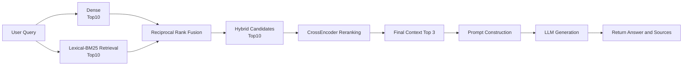

# Study Notes

A full-stack technical notes platform with an evaluation-driven Retrieval-Augmented Generation (RAG) system.

The project combines a Next.js frontend, FastAPI backend, PostgreSQL/pgvector storage, hybrid retrieval, CrossEncoder reranking, and LLM-based evaluation.

It started as a personal technical notes application and evolved into a practical RAG engineering project focused on retrieval quality, evaluation, and deployment.

---

## Highlights

- Full-stack technical blog with Markdown posts, search, tags, pagination, authentication, and protected admin actions
- Dense semantic retrieval with sentence-transformers
- BM25 lexical retrieval for mixed Chinese, English, and technical content
- Hybrid retrieval using Reciprocal Rank Fusion (RRF)
- CrossEncoder reranking for final context selection
- Retrieval evaluation with Recall@K and MRR@K
- Generation evaluation using an LLM-as-a-judge workflow
- Runtime metadata tracking for reproducible experiments
- Source attribution from retrieved blog sections

---

## RAG Architecture

The current system uses a two-stage retrieval pipeline:



Dense and lexical retrieval are used to build a high-recall candidate pool.  
A CrossEncoder then reranks those candidates before the final context is passed to the generation model.

Current configuration:

- Dense embedding model: `sentence-transformers/paraphrase-multilingual-MiniLM-L12-v2`
- Hybrid fusion: Reciprocal Rank Fusion
- Reranker: `BAAI/bge-reranker-v2-m3`
- Candidate depth: 10
- Final context depth: 3

---

## Retrieval Evaluation

The retrieval pipeline is evaluated against a manually defined benchmark with annotated gold sections.

Current Stage 2 results:

| Stage | Recall | MRR@3 |
|---|---:|---:|
| Dense Retrieval | Recall@10 = 1.00 | 0.733 |
| BM25 Retrieval | Recall@10 = 0.90 | 0.900 |
| RRF Hybrid Retrieval | Recall@10 = 1.00 | 0.833 |
| CrossEncoder Reranking | Recall@3 = 1.00 | 0.933 |

The two stages serve different purposes:

```text
Hybrid Recall@10 = 1.00
        ↓
Gold sections reach the candidate pool
        ↓
CrossEncoder reranking
        ↓
Recall@3 = 1.00
MRR@3   = 0.933
```

The hybrid stage focuses on candidate coverage, while the reranker improves the ordering of the final context.

### Experiment Summary

The initial dense-retrieval baseline achieved an MRR@3 of `0.733`.

BM25 was introduced to improve exact-term and technical-token retrieval. It performed strongly on the benchmark, but lexical retrieval alone still missed some semantically relevant candidates.

The next iteration combined dense and lexical retrieval with Reciprocal Rank Fusion (RRF). Rather than optimizing only for the top few results, the candidate pool was expanded to top 10 so that relevant chunks would have a better chance of reaching the reranking stage.

A representative failure case was the `CORSMiddleware` query:

- Dense retrieval found the gold section at rank 4
- BM25 did not retrieve it within the top 10
- RRF kept it in the hybrid candidate pool at rank 7
- CrossEncoder reranking promoted it to rank 3

The final two-stage pipeline achieved:

- Hybrid Recall@10: `1.00`
- CrossEncoder Recall@3: `1.00`
- CrossEncoder MRR@3: `0.933`

This led to the current design: the retrieval stage focuses on candidate coverage, while the CrossEncoder focuses on final ranking quality.

---

## Generation and Evaluation

The final retrieved chunks are inserted into a structured prompt and sent to the generation model through Ollama.

Current models:

- Generation: `qwen3:4b-instruct-2507-q4_K_M`
- Evaluation judge: `qwen3:8b-q4_K_M`

Generation evaluation uses an LLM-as-a-judge workflow.

Each evaluation run records runtime metadata including:

- code version
- prompt version
- generation and judge configuration
- embedding configuration
- retrieval configuration
- chunking configuration
- reranking configuration

This makes evaluation results traceable to the configuration that produced them.

---

## Tech Stack

### Frontend

- Next.js 15
- React 19
- TypeScript
- Tailwind CSS 4
- Remark / GFM

### Backend

- Python
- FastAPI
- SQLAlchemy
- Pydantic
- Alembic
- PostgreSQL / pgvector
- JWT authentication

### RAG / ML

- sentence-transformers
- BM25
- jieba
- Reciprocal Rank Fusion
- CrossEncoder reranking
- Ollama
- Qwen3

### Infrastructure

- Supabase
- Vercel
- Docker — planned

---

## Project Structure

```text
study_notes/
├── backend/
│   ├── app/
│   │   ├── api/
│   │   ├── db/
│   │   ├── rag/
│   │   │   ├── evaluation/
│   │   │   ├── ingestion/
│   │   │   ├── pipeline.py
│   │   │   ├── retrieval_dense.py
│   │   │   ├── retrieval_lexical.py
│   │   │   ├── retrieval_hybrid.py
│   │   │   └── reranking.py
│   │   └── schemas/
│   └── experiments/
│
└── frontend/
    └── src/
        ├── app/
        └── evaluation/
```

---

## Current Status

Completed:

- [x] Full-stack technical notes application
- [x] Dense + BM25 retrieval
- [x] Hybrid retrieval with RRF
- [x] CrossEncoder reranking
- [x] Retrieval evaluation
- [x] LLM generation
- [x] LLM-as-a-judge evaluation
- [x] Runtime metadata tracking

Next priorities:

- [ ] Dockerized deployment
- [ ] Reproducible production setup
- [ ] Structured logging and latency measurement
- [ ] Retrieval-index refresh strategy
- [ ] Expanded evaluation and regression testing

---

## Local Development

Reproducible local setup instructions will be added as part of the upcoming Docker and deployment work.
